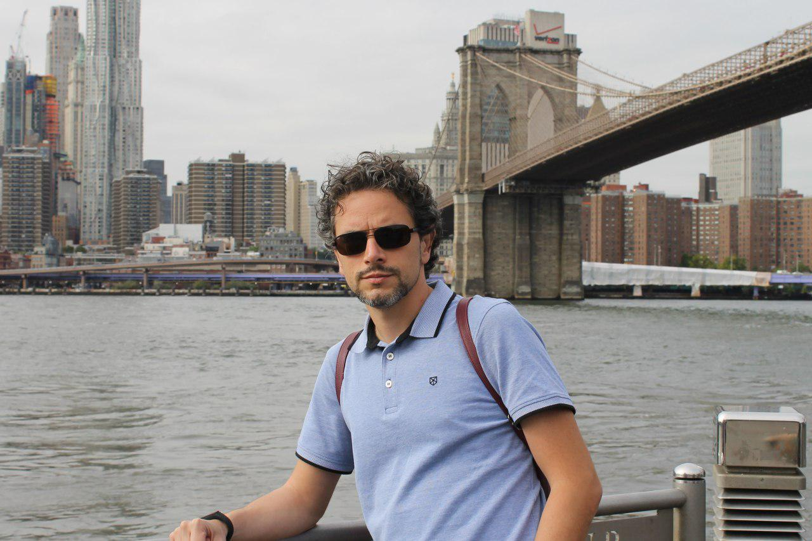

I suppose it happens to everyone, but defining myself is not easy at all, I have a bad habit of trying to tell more things than are really assimilable in a short period of time, so I will try to be brief, although it won't be easy.

I was born in Malaga, but some people probably say it is a lie, until I show them my ID. I spent an important part of my life in Almuñécar and I came to study in Cáceres, where I currently have my entire life. When they ask me, I usually say: _"Born in Malaga, a lifelong in Almuñécar and from Cáceres in spirit."_

The photo that heads this article is from last October 2018. It is a normal photo, in which you can see Manhattan and the Brooklyn Bridge in the background. New York has always been a city that I wanted to visit and in 2018 I fulfilled that dream.

I've always had a lot to drink from American culture, at least from what they tried to sell us on television and in movies, so I have a great predilection for the stars and stripes. I guess also partly because I was born in the eighties and lived through the golden age of Hollywood, action movies and the abuse of special effects.

I'm a huge cinema fan, I have seen an absurd quantity of movies and many other series. As a result, it is the reason for my “nickname” (I don't know if that word already sounds very _old-school_) which is kind the union of two of my favorite movie characters: Neo (played by Keanu Reeves in The Matrix) and Vasili Záitsev (played by Jude Law in Enemy at the Gates) -> _NeoVasili_.

But if there is a hobby that stands out in me, it is video games. I've been _playing Martians_ for as long as I can remember, and will continue to do so as long as I can. Thanks to this, I have lived through hundreds of unforgettable experiences and I have learned a lot. Not surprisingly, I have a huge collection of games, consoles and the most varied gossip, worthy of any collector worth their salt.

Even though I have spent many years away from another of my great hobbies, lately I've been fortunate to be able to take it up again step by step and the fact is that the _legos_ are not cheap, but they provide endless hours of fun, concentration, creativity and learning.

On the professional side, I have played many suits, almost all around web development and although I'm more of a _backend guy_ the truth is that every time I have been opting more and more towards the dark side, the sewers. Terminals have become my greatest allies, understanding cloud computing (AWS) my mantra, and systems architecture my specialty.

I still do a lot of everything, and while the “devops role” is very fashionable now, which is so bad for some to say that, the truth is that I have breathed the devops culture for a few years now. When I could, I have applied it in my day to day life and when not, as I have adapted to the circumstances.

I do not complain or regret any of the steps I have taken, I have always learned something from each of them. I'm passionate about science, I always wanted to be an astronaut. I have spent an insulting amount of hours on the bike saddle pedaling, I like the places it has taken me and the comforting feeling of coming home after several hours pushing my endurance to the limit. I love traveling, soaking up other cultures and discovering the history they contain.

But if there is something that characterizes me, it is that I love to learn, face new challenges, overcome them and continue learning, although it can be stressful, I like to have that feeling that there are so many things to do and learn, that you don't know where to put the focus. I am a restless mind like few others.
